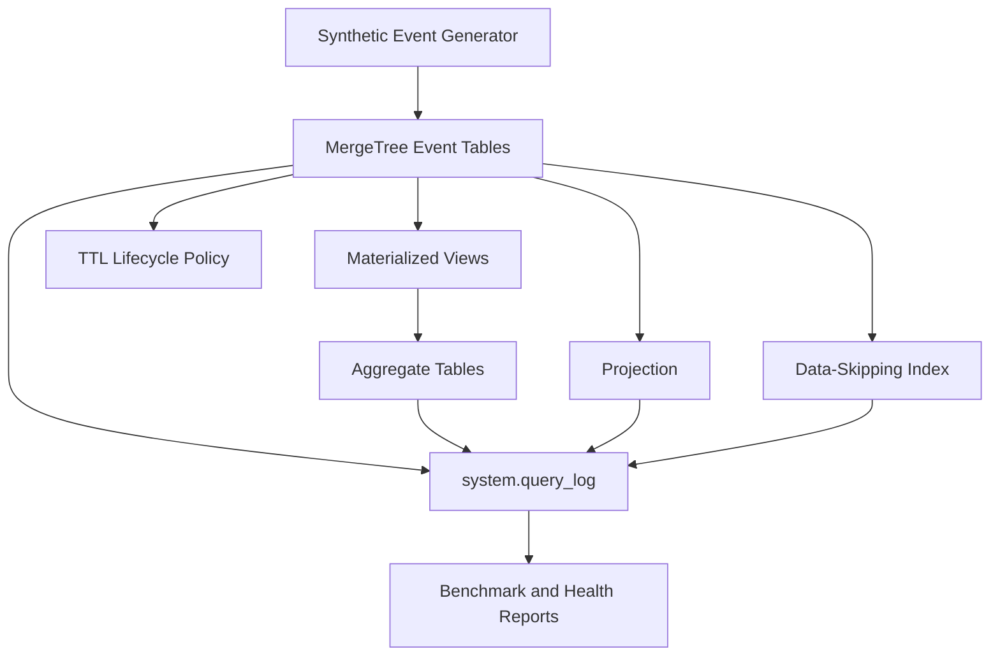

# ClickHouse Data Engineering Lab

A reproducible, Docker-based laboratory for exploring ClickHouse storage design, query optimization, aggregation strategies, data lifecycle management, and operational observability.

This project demonstrates how different ClickHouse features affect query performance, storage efficiency, and data scanned using controlled synthetic datasets and measurable benchmarks.

## Project Objectives

The project investigates several practical data-engineering questions:

- How should analytical event data be modeled in ClickHouse?
- How much storage can columnar compression save?
- When should materialized views and aggregate states be used?
- How do projections affect point-lookup queries?
- How effective are data-skipping indexes?
- How can TTL policies automate data retention?
- How can ClickHouse performance and operational health be monitored?

## Architecture



## Technology Stack

- ClickHouse 25.8
- Docker and Docker Compose
- SQL
- MergeTree and AggregatingMergeTree
- Materialized views
- Projections
- Data-skipping indexes
- TTL policies
- ClickHouse system tables
- Git and GitHub

## Repository Structure

```text
clickhouse-data-engineering-lab/
├── clickhouse/
│   └── init/
│       └── 01_schema.sql
├── SQL/
│   ├── 02_generate_synthetic_events.sql
│   ├── 03_analytics_and_benchmark.sql
│   ├── 04_materialized_view.sql
│   ├── 05_additive_rollup.sql
│   ├── 06_user_lookup_projection.sql
│   ├── 07_ttl_data_lifecycle.sql
│   ├── 08_data_skipping_index.sql
│   └── 09_observability.sql
├── .env.example
├── .gitignore
├── docker-compose.yml
├── LICENSE
└── README.md
```

## Implemented Experiments

### 1. Event Data Model

The primary event table demonstrates:

- `MergeTree` storage
- Monthly partitioning
- Carefully selected `ORDER BY` keys
- `LowCardinality` columns
- `DateTime64` timestamps
- Materialized date columns
- UUID generation
- Compressed analytical storage

### 2. Synthetic Dataset Generation

The project generates one million deterministic analytical events directly inside ClickHouse.

The generated dataset includes:

- Users and sessions
- Event types
- Platforms
- Countries
- Event durations
- Revenue
- JSON-like properties
- Multiple monthly partitions

A separate three-million-row dataset is generated for the data-skipping-index experiment.

### 3. Analytical Queries and Baseline Benchmarking

The analytical workload includes:

- Daily event trends
- Unique-user calculations
- Revenue aggregation
- Platform and event-type analysis
- Partition inspection
- Query-log analysis
- Storage and compression measurements

### 4. Materialized View with Aggregate States

A materialized view pre-aggregates event metrics by:

- Event date
- Event type
- Platform

It demonstrates `AggregatingMergeTree` and aggregate-state functions such as:

- `countState`
- `uniqCombined64State`
- `sumState`
- `minState`
- `maxState`

This experiment also highlights an important trade-off: aggregate states provide flexibility for merging partial results but may consume more storage than simple additive metrics.

### 5. Additive Rollup

A second materialized view stores additive metrics such as:

- Event count
- Total revenue
- Total duration

The additive rollup reduced storage from approximately **15.34 MiB** for aggregate states to approximately **11.55 KiB** for the same number of grouped rows.

This demonstrates that simple additive metrics can be significantly more storage-efficient when advanced aggregate-state merging is unnecessary.

### 6. User-Lookup Projection

A covering projection was created for user-based lookup queries.

The benchmark showed:

| Metric | Projection Disabled | Projection Enabled |
|---|---:|---:|
| Rows read | 1,000,000 | 32,768 |
| Data read | 8.05 MiB | 557.06 KiB |
| Execution time | 8 ms | 6 ms |

The projection reduced the number of rows read by approximately **96.72%**.

### 7. TTL Data Lifecycle

A dedicated TTL experiment demonstrates automated data retention.

The workflow includes:

- Inserting expired and active records
- Adding a TTL policy
- Forcing a merge
- Confirming that expired records are removed
- Inspecting the remaining active parts

After TTL execution, only the two active records remained in the demonstration table.

### 8. Data-Skipping Index

A three-million-row dataset was used to test a `set` data-skipping index for a selective status-code filter.

| Metric | Index Disabled | Index Enabled |
|---|---:|---:|
| Matching rows | 10,000 | 10,000 |
| Rows read | 3,000,000 | 16,384 |
| Data read | 5.77 MiB | 96.00 KiB |
| Execution time | 8 ms | 4 ms |
| Memory used | 536.83 KiB | 386.77 KiB |

The index reduced the number of rows read by **99.45%** while returning the same result.

### 9. Observability and Operational Monitoring

The observability module reports:

- Server version and uptime
- Disk utilization
- Table and partition sizes
- Compression ratios
- Active and small data parts
- Running queries
- Background merges
- Pending or failed mutations
- Expensive queries
- Failed-query history
- Repeated query patterns
- Real-time ClickHouse metrics

The final health check summarizes active queries, merges, mutations, parts, and recent failures.

## Benchmark Summary

| Optimization | Baseline rows read | Optimized rows read | Reduction |
|---|---:|---:|---:|
| Covering projection | 1,000,000 | 32,768 | 96.72% |
| Data-skipping index | 3,000,000 | 16,384 | 99.45% |
| Materialized aggregation | 362,319 | 750 | 99.79% |
| Additive rollup | 362,319 | 750 | 99.79% |

> Execution time depends on hardware, cache state, background merges, and dataset size. For this reason, rows read and bytes read are included as more reproducible indicators of optimization effectiveness.

## Storage Findings

For the generated datasets:

| Table | Rows | Disk size | Compression ratio |
|---|---:|---:|---:|
| `events` | 1,000,000 | 47.91 MiB | 2.37× |
| `skip_index_demo` | 3,000,000 | 24.81 MiB | 5.76× |
| `daily_event_metrics` | 1,365 | 15.34 MiB | 1.00× |
| `daily_additive_metrics` | 1,365 | 11.55 KiB | 3.93× |

The results show that storage design and aggregation strategy can have a substantial effect on analytical-system efficiency.

## Getting Started

### Prerequisites

Install:

- Docker Desktop
- Git
- A terminal such as PowerShell
- At least 2 GB of available memory

### Clone the Repository

```bash
git clone https://github.com/hashemi-parisa/clickhouse-data-engineering-lab.git
cd clickhouse-data-engineering-lab
```

### Configure the Environment

Create a local `.env` file from the example:

```bash
cp .env.example .env
```

On PowerShell:

```powershell
Copy-Item .env.example .env
```

Update the local credentials in `.env`.

Do not commit the `.env` file.

### Start ClickHouse

```bash
docker compose up -d
```

Check the container:

```bash
docker compose ps
```

### Connect to ClickHouse

```bash
docker exec -it clickhouse-lab clickhouse-client \
  --user YOUR_USER \
  --password YOUR_PASSWORD
```

For PowerShell:

```powershell
docker exec -it clickhouse-lab clickhouse-client --user YOUR_USER --password YOUR_PASSWORD
```

## Running the Experiments

The scripts should be executed in numerical order.

Example for PowerShell:

```powershell
Get-Content .\SQL\02_generate_synthetic_events.sql -Raw |
docker exec -i clickhouse-lab clickhouse-client `
  --user YOUR_USER `
  --password YOUR_PASSWORD `
  --multiquery
```

Then run:

```text
03_analytics_and_benchmark.sql
04_materialized_view.sql
05_additive_rollup.sql
06_user_lookup_projection.sql
07_ttl_data_lifecycle.sql
08_data_skipping_index.sql
09_observability.sql
```

Alternatively, execute a single file on one line:

```powershell
Get-Content .\SQL\09_observability.sql -Raw | docker exec -i clickhouse-lab clickhouse-client --user YOUR_USER --password YOUR_PASSWORD --multiquery
```

## Resetting the Environment

Stop the container while preserving its data:

```bash
docker compose down
```

Remove the containers and the ClickHouse volume:

```bash
docker compose down -v
```

The second command permanently removes the locally generated database data.

## Security Notes

- Secrets are stored only in the local `.env` file.
- `.env` is excluded through `.gitignore`.
- `.env.example` contains placeholders only.
- No production or personal data is included.
- All benchmark data is synthetically generated.
- Credentials should never be written directly into SQL files or committed to Git.

## Key Takeaways

This project demonstrates that:

1. Primary-key and partition design directly affect the amount of data scanned.
2. Materialized views can reduce repeated aggregation work.
3. Aggregate states provide flexibility but may increase storage consumption.
4. Additive rollups can be extremely compact.
5. Projections improve suitable lookup and aggregation patterns.
6. Data-skipping indexes are effective only when the indexed expression is selective.
7. TTL policies automate retention but depend on MergeTree background merges.
8. ClickHouse system tables provide detailed operational visibility.
9. Performance should be evaluated using rows read, bytes read, memory, and execution time together.

## Future Work

Planned extensions include:

- Kafka or Redpanda streaming ingestion
- Python-based event producers
- Grafana monitoring dashboards
- Prometheus metrics
- Multi-node ClickHouse deployment
- Replicated and distributed tables
- Automated benchmark execution
- Continuous integration checks

## Author

**Parisa Hashemi**

Data Engineer interested in analytical databases, distributed data systems, data-intensive applications, and applied machine learning.

- GitHub: [hashemi-parisa](https://github.com/hashemi-parisa)
- Project: [clickhouse-data-engineering-lab](https://github.com/hashemi-parisa/clickhouse-data-engineering-lab)

## License

This project is available under the [MIT License](LICENSE).